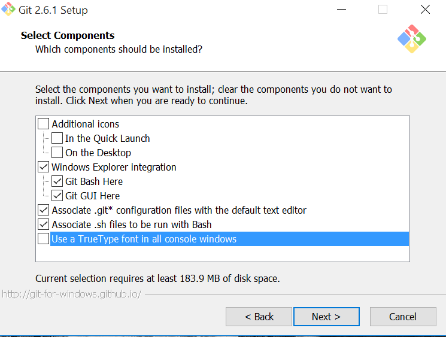
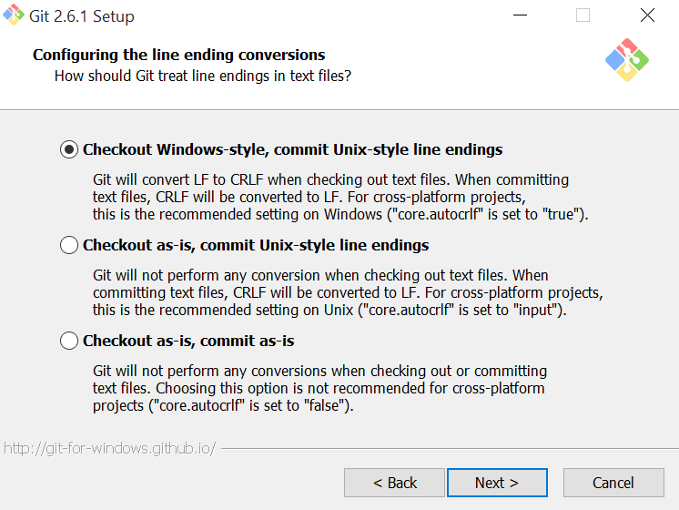
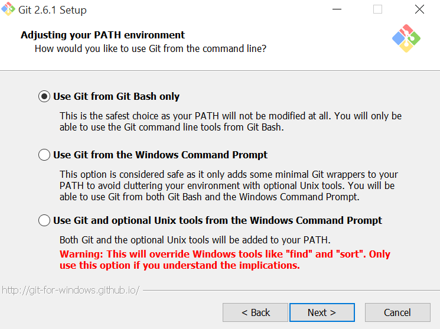
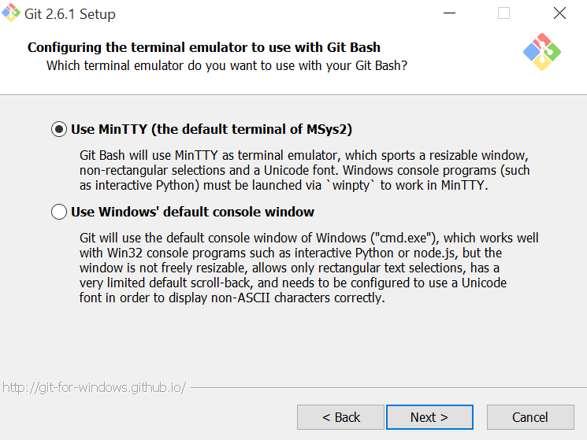

# Installation within windows

## Vagrant

[Download][1] and install the newest version of vagrant.

### Plugin

#### Hostmanager

```{.sh}
vagrant plugin install vagrant-hostmanager
```

## Provider

You need at least one of this providers to use vagrant-php.

### Virtualbox

[Download][2] and install the newest version of virtualbox and virtualBox extension pack.

### VMWare

[Download][3] and install the newest version of vmware workstation.

Install the vagrant vmware plugin

```{.sh}
vagrant plugin install vagrant-vmware-workstation
```

You need to get a [license][4] and follow the instructions within the mail from HashiCorp.

## Shared Filesystem

### NFS

If you want to use nfs instead of the default shared filesystem of the provider, for example for performance reasons,
or cause the kernel module of the provider does problem, you need to install the `vagrant-winnfsd` vagrant plugin.

```{.sh}
vagrant plugin install vagrant-winnfsd
```

## Git / SSH client

[Download][5] and install the newest version of git. You will get an ssh client as well, which can be used by vagrant.

### components



### git integration



### path



### terminal integration



## Usage

Press `Windows` Key, enter `git bash`, press `ctrl + shif + enter`. You get a simple a bash shell which supports most
simple unix commands, which allows you to use the [create-symfony-project][6] for example.

### Virtualbox

While `winnfsd` got a much better read performance than `vboxfs` i suggest to prefere it for all read operations
But for `composer install` or other write intensive operations its faster to change the `sharetype` to `native`
and reboot the virtual machine by calling `vagrant halt && vagrant up` within the bash.


[1]: https://www.vagrantup.com/downloads.html
[2]: https://www.virtualbox.org/wiki/Downloads
[3]: https://www.vmware.com/products/workstation
[4]: https://www.vagrantup.com/vmware
[5]: https://git-for-windows.github.io
[6]: https://github.com/vagrant-php/create-symfony-project
